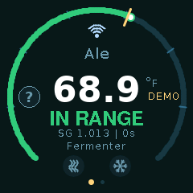
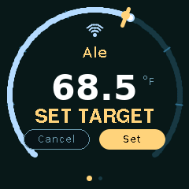
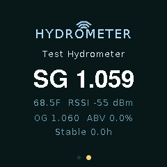
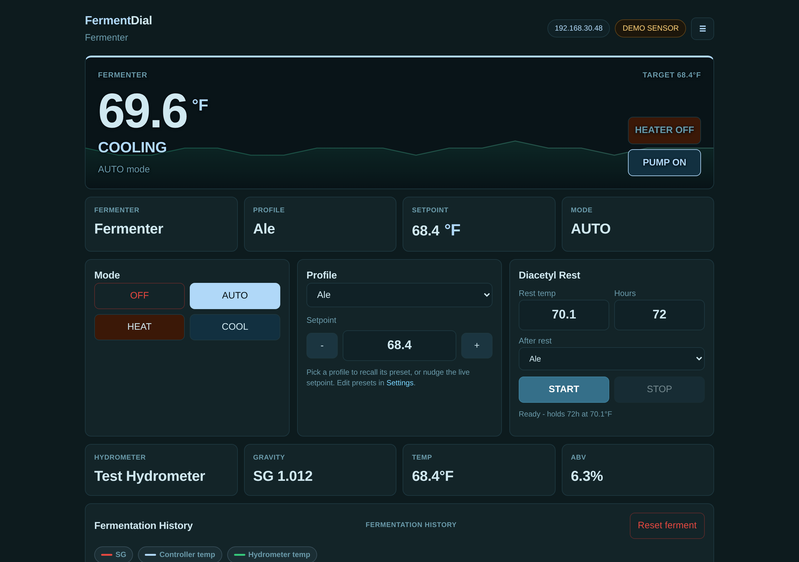
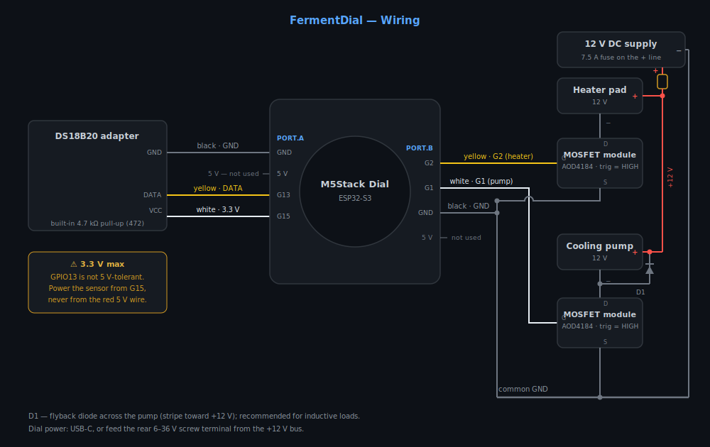
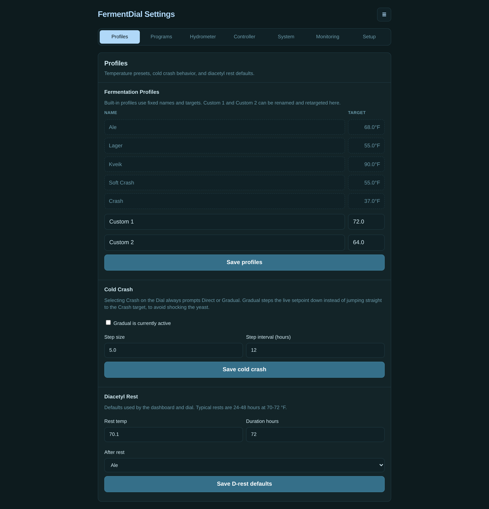
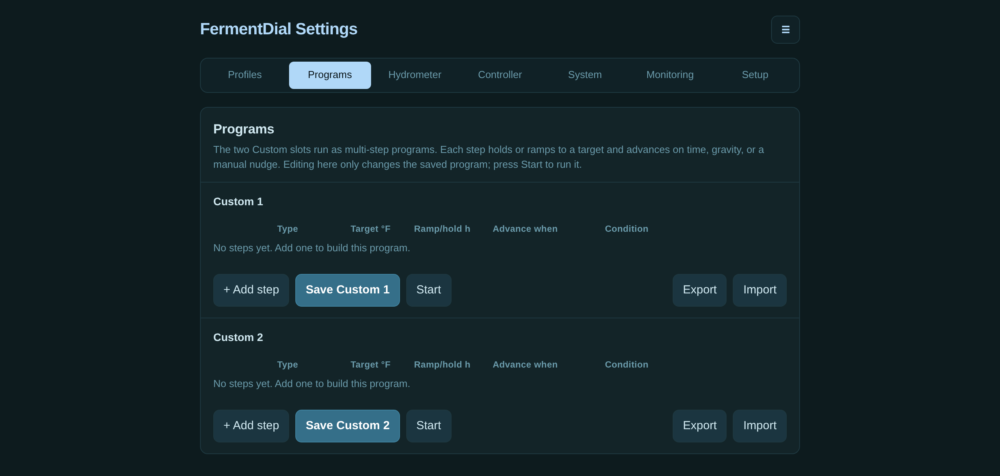
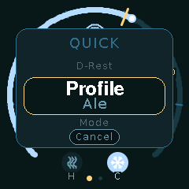
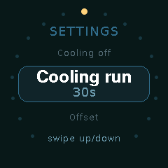
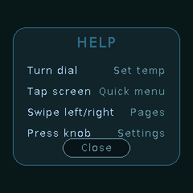

# FermentDial

Appliance-style fermentation temperature controller firmware for the
**M5Stack Dial** (ESP32-S3). It drives a heater pad and a cooling pump around a
DS18B20 probe, reads Bluetooth hydrometers, and serves a full web dashboard —
while staying fully usable standalone on the Dial's round touchscreen if Wi-Fi
is never configured.

> **Status:** the firmware is feature-complete and heavily exercised in demo
> mode (simulated sensor, outputs disabled), but the first physical 12 V
> build is still in progress — the hardware path hasn't been burned in on a
> real rig yet. Build reports and issues are very welcome.

<p align="center">
  
  
  
</p>

<p align="center">
  
</p>

## Features

- **Local-first control** — profiles (Ale, Lager, Kveik, Soft Crash, Crash, two
  custom slots), heat/cool/auto/off modes, hysteresis and pump-protection
  timing, all adjustable from the Dial itself. Wi-Fi is optional.
- **Round-screen UI** — rotate the encoder to nudge the setpoint (with
  confirm), tap for a quick menu, swipe between pages, hold for settings.
- **BLE hydrometers** — Tilt, Tilt Pro, and RAPT Pill. Gravity, ABV, and
  gravity velocity on the Dial and dashboard.
- **Multi-step programs** — the custom slots run step programs that hold or
  ramp and advance on time, gravity, or gravity velocity (e.g. "hold 68 °F
  until SG < 1.020, then rest, then crash").
- **Guided cold crash** — direct or gradual (stepped) crash to avoid shocking
  the yeast, plus a one-tap diacetyl rest with automatic return profile.
- **Web dashboard (PWA)** — embedded Svelte app served from the firmware:
  live status, mode/profile/setpoint control, program editor, fermentation
  history graph, CSV export, and a settings area with device self-check.
- **Batch tracking & calibration** — named batch sessions with exportable
  snapshots, and single-point temperature calibration (ice-point supported)
  from the web UI.
- **Integrations** — MQTT with Home Assistant discovery, Brewfather custom
  stream, InfluxDB, and a Prometheus-style `/metrics` endpoint.
- **OTA updates** — over HTTP from PlatformIO or by uploading a `.bin` in the
  browser. Optional admin password protects config pages and OTA.
- **Screen mirror** — demo/dev builds serve the Dial's framebuffer at
  `/screen`, with remote tap/scroll injection for UI testing.

## Hardware

| Connection | Wiring |
| --- | --- |
| GPIO13 (PORT.A yellow) | DS18B20 DATA (adapter has built-in 4.7 kΩ pull-up) |
| GPIO15 (PORT.A white) | DS18B20 VCC — driven HIGH as a software 3.3 V rail |
| M5 GND | DS18B20 GND |
| GPIO2 (PORT.B yellow) | Heater MOSFET trigger input (active HIGH) |
| GPIO1 (PORT.B white) | Pump MOSFET trigger input (active HIGH) |
| M5 GND | MOSFET trigger ground |
| 12 V input | 7.5 A fuse → +12 V bus |
| Heater/pump + | +12 V bus |
| Heater/pump − | MOSFET switched negative (low-side, AOD4184) |



Electrical notes:

- The DS18B20 adapter's pull-up ties DATA to VCC, and GPIO13 is a
  3.3 V-max input — power the sensor from the GPIO15 soft rail (or another
  3.3 V source), **never 5 V**.
- The heater pad and cooling pump are low-side-switched 12 V DC loads.
- Add a flyback diode across the pump terminals (stripe toward +12 V) — the
  pump is an inductive load and the diode protects the MOSFET from switching
  spikes. The heater pad is resistive and does not need one.
- The firmware never intentionally energizes heater and pump at the same
  time, enforces pump minimum-off/minimum-run times, and forces physical
  outputs OFF in demo-sensor builds.

## Getting Started

The repo pins PlatformIO through [`uv`](https://docs.astral.sh/uv/) — no
global `pio` install needed.

```sh
git clone https://github.com/lichuu/fermentdial.git
cd fermentdial
uv run platformio run                  # builds the default (demo) environment
uv run platformio run -t upload        # flash over USB
uv run platformio device monitor
```

Optionally bake in Wi-Fi credentials (otherwise use the setup AP below):

```sh
cp include/secrets.example.h include/secrets.h   # gitignored; edit as needed
```

### Build environments

| Environment | Sensor | Wi-Fi / OTA | Use |
| --- | --- | --- | --- |
| `m5stack_dial_demo` (default) | simulated | yes | try everything with no wiring; outputs forced OFF |
| `m5stack_dial_wifi` | DS18B20 | yes | real fermentation control with dashboard |
| `m5stack_dial` | DS18B20 | no | fully offline controller |
| `native`, `native_demo` | – | – | host-side unit tests |

```sh
uv run platformio run -e m5stack_dial_wifi -t upload
```

Demo builds show a `DEMO SENSOR` badge and cannot energize hardware — do not
use them for actual fermentation control.

## Wi-Fi Setup and Web UI

If no credentials are saved, the Dial starts a setup access point:

- SSID: `FermentDial-Setup-XXXX` (open network)
- Setup page: `http://192.168.4.1/` (scan networks, enter your Wi-Fi password)
- Dashboard: `http://192.168.4.1/dashboard`

Once joined to your network, the dashboard lives at the device's IP or at
`http://fermentdial-XXXX.local/` via mDNS. The web app installs as a PWA and
stays responsive on phones.

<p align="center">
  
</p>

<p align="center">
  
</p>

Settings cover profiles, step programs, hydrometer selection, controller
tuning, MQTT/Home Assistant, Brewfather, InfluxDB, history logging, an
optional admin password (blank = unlocked), and a guided first-run
self-check. Fermentation history is graphed on the dashboard and exportable
as CSV.

## OTA Updates

The easiest path: **Settings → System → Check for updates** in the web
dashboard. Your browser fetches the latest release from this project's GitHub
Pages site and streams it to the Dial — the device itself never needs
internet access. Release binaries are also attached to
[GitHub Releases](https://github.com/lichuu/fermentdial/releases) for manual
upload at `/firmware`.

For development, network builds accept updates over HTTP after the first USB
flash:

```sh
uv run platformio run -e m5stack_dial_wifi_ota -t upload --upload-port <device-ip>
```

(`m5stack_dial_demo_ota` is the demo equivalent.) You can also upload a
firmware `.bin` from the browser at `/firmware`. If an admin password is set,
export `FERM_OTA_PASSWORD` for CLI uploads.

## Dial UI Tour

<p align="center">
  
  
  
</p>

- **Rotate** — adjust the setpoint (confirm/cancel prompt).
- **Tap** — quick menu: profile, mode, cold crash.
- **Swipe** — switch between controller and hydrometer pages.
- **Hold** — full settings menu (profiles, deltas, output tests, Wi-Fi,
  about).

## Development

- **Web UI** (`webui/`): Svelte + Vite, embedded into firmware as compressed
  assets. `npm run dev` serves the UI standalone; set `DEVICE_HOST` in
  `webui/.env.local` (see `.env.example`) to proxy API calls to a live
  device. `npm run build` regenerates `src/web_assets.h`.
- **Tests**: `uv run platformio test -e native` (control logic, settings),
  plus a golden-image baseline in `test/golden` and a device-driven UI smoke
  harness in `test/smoke` that uses the screen mirror.
- **Screen mirror**: mirror builds serve the live framebuffer at `/screen`
  and accept remote input at `/api/screen/input` — handy for screenshots and
  remote debugging.
- **Fonts**: `tools/make_vlw_font.py` converts TTFs to M5GFX VLW fonts.

Build all firmware environments before calling a change verified:

```sh
uv run platformio run -e m5stack_dial -e m5stack_dial_demo -e m5stack_dial_wifi
```

## License

[MIT](LICENSE) © lichuu
